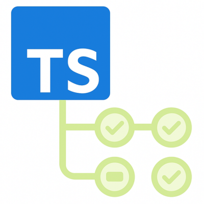

[](https://github.com/JLarky/gha-ts/releases/latest)
[](https://github.com/JLarky/gha-ts/blob/main/LICENSE)

#  gha-ts

A TypeScript library for writing GitHub Action workflows.

## What?

[Pkl](https://pkl-lang.org/) is a configuration as code language with rich validation.
YAML, the language used for GitHub Actions on the other hand, is a configuration language with **no validation** at all.
We have to rely on third-party tools or IDE support to validate our GitHub Actions.
While this will get better over time, it's still not as good as having a language with rich validation out of the box.

This is where **this** template comes in.
It allows you to write your GitHub Action Workflows in Pkl
and then compile them (using the [Pkl cli](https://pkl-lang.org/main/current/pkl-cli/index.html#installation)) to YAML.
The generated YAML output, if successfully converted, 
is definitely YAML validated and ready to be used as your Action Workflows.

## How?

**1. Write a `Pkl` file and `amend` this template**

Create a `.github/src/test.ts` file with the following content:

```ts
import { workflow } from "@jlarky/gha-ts/workflow-types";
import { checkout } from "@jlarky/gha-ts/actions";

export default workflow({
  name: "Test",
  on: {
    // Define your `on` triggers. E.g.:
    push {
      branches {
        "main"
      }
    }
    pull_request {}
  },
  jobs {
    // Define your `jobs`. E.g.: 
    test: {
      "runs-on": "ubuntu-latest",
      // Define your `steps`. E.g.:
      steps {
        checkout({
          fetchDepth: 0
        }),
        {
          name: "Setup nexus credentials",
          run: `
            mkdir ~/.gradle
            echo "systemProp.nexusUsername=\(Context.secret("NEXUS_USERNAME")) >> ~/.gradle/gradle.properties
            echo "systemProp.nexusPassword=\(Context.secret("NEXUS_PASSWORD")) >> ~/.gradle/gradle.properties
          `
        },
        {
          name: "Test android app",
          run: "./gradlew testDebugUnitTest",
        }
      }
    }
  });
```

**2. Install the Pkl cli**

For macOS it as simple as:

```bash
brew install pkl
````

For other platforms, please follow the [official installation guide](https://pkl-lang.org/main/current/pkl-cli/index.html#installation).

**3. Convert the Pkl file to Yaml**

create a `.github/build.ts` file with the following content (Using Bun):

```ts
#!/usr/bin/env bun
import { dirname, resolve } from "path";
import { fileURLToPath } from "url";
import { generateWorkflows, scanWorkflows } from "@jlarky/gha-ts/cli";
import { createSerializer } from "@jlarky/gha-ts/render";

async function main() {
  const _dirname = dirname(fileURLToPath(import.meta.url));
  const workflowsDir = resolve(_dirname, ".github/workflows");
  const srcDir = resolve(_dirname, ".github/src");

  await generateWorkflows({
    srcModules: await scanWorkflows({ srcDir, outDir: workflowsDir }),
    onModule: async (module) => {
      createSerializer(module.workflow, Bun.YAML.stringify).writeWorkflow(
        module.outFile
      );
    },
  });
}

main().catch((err) => {
  console.error(err);
  process.exit(1);
});
```

Or using Node.js:

```ts
#!/usr/bin/env node
import { YAML } from "yaml";
import { dirname, resolve } from "path";
import { fileURLToPath } from "url";
import { generateWorkflows, scanWorkflows } from "@jlarky/gha-ts/cli";
import { createSerializer } from "@jlarky/gha-ts/render";

async function main() {
  const _dirname = dirname(fileURLToPath(import.meta.url));
  const workflowsDir = resolve(_dirname, ".github/workflows");
  const srcDir = resolve(_dirname, ".github/src");

  await generateWorkflows({
    srcModules: await scanWorkflows({ srcDir, outDir: workflowsDir }),
    onModule: async (module) => {
      createSerializer(module.workflow, YAML.stringify).writeWorkflow(
        module.outFile
      );
    },
  });
}

main().catch((err) => {
  console.error(err);
  process.exit(1);
});
```

Then run the script:

```bash
bun run -watch .github/build.ts
```

or

```bash
chmod + x .github/build.ts
.github/build.ts
```

## Why?

* **Strong typing**: Pkl is a strongly typed language. This means that you can't accidentally use a wrong type in your
  configuration.
* **Simplicity**: Strong validation and strong typing but still simple to write.

## Examples

You can find real-life examples in the [.github/pkl-workflows](.github/pkl-workflows) directory of this repository.
There are also some examples in the [examples](examples) directory.

The (right now) supported templates looks like that:
```
name: String
on: On
env: EnvironmentVariables?
concurrency: Concurrency?
permissions: (*Permissions|"read-all"|"write-all")?
jobs: Jobs
```

The template itself as well as the `class` definitions can be found in the [Workflow.pkl](Workflow.pkl) file.

## Adopters

This module is already used in the following repositories:
* [StefMa/pkl-gha](https://github.com/StefMa/pkl-gha/tree/725a23cc42112a11dec32ff934d3166bddc54e5c/.github/pkl-workflows)
* [pkl-community/setup-pkl](https://github.com/pkl-community/setup-pkl/tree/52a58184f4f3e64a7fd8444f2a5dee6fa8eeba58/.github/pkl-workflows)
* [realm/realm-dotnet](https://github.com/realm/realm-dotnet/tree/d44ca659e2744ce0a210ff7ffbcb59607d8b3dac/.github/pkl-workflows)

Additionally, it is used in the internal codebase of the [ioki](https://ioki.com/en/platform/) Android White-Label Apps.

Let me know if you have also adopted the module, or submit a PR!

## Release

**Step 1**: Make sure you're on the `main` branch and pull the latest changes.

```bash
git checkout main
git pull origin main
```

**Step 2**: Create a git tag in form of `com.github.action@[SEMVER_VERSION]`.

```bash
git tag com.github.action@[SEMVER_VERSION]
```

> [!IMPORTANT]
> The `[SEMVER_VERSION]` should be the same as the version in the `PklProject` and `doc-package-info.pkl` files.

**Step 3**: Push the tag to the remote repository.

```bash
git push origin com.github.action@[SEMVER_VERSION]
```

**Step 4**: The tag creates a new release on GitHub.
Go to the [releases](https://github.com/JLarky/gha-ts/releases) page and edit the new release.
Put some information about the changes in the description and publish the release.

**Step 5**: Update the version in the [PklProject](PklProject) and [doc-package-info](doc-package-info.pkl) files.
Adjust the version to the next [Semantic Versioning](https://semver.org/) version.

Commit and push the changes:
```bash
git commit -m "Bump version to [SEMVER_VERSION]" .
git push origin main
```
